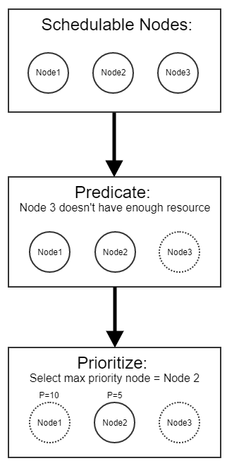
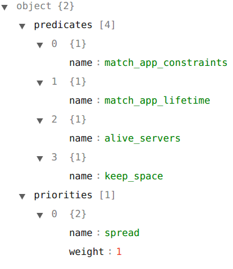
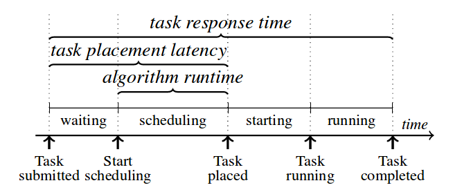

Powered by R Notebook

## Problem

Now the scheduler is hard coded, and it is hard to customize the behaviour of the scheduler. Although it has some built-in scheduling strategies, it is not enough.

## Perior state-of-the-art implemenetation

The architecture of scheduler before this research is simple, which has two strategies: spread and pack.

In the spread mode, the scheduler will select a new node to run the app. And spread mode is the default mode in treadmill.

In the pack mode, the scheduler will select the same node until the node has no capacity.

## Idea

In this project, we introduces a scheduler framework to solve the problem. We learnt from a lot of cluster management tools such as Apache Mesos, Kubernetes, Borg, Omega and Sparrow. We decided to implement the logic similar to Kubernetes scheduler as the centralized scheduler.



There are two phases during the process of scheduling in Kubernetes: predicates and priorities. Predicates are mandatory rules to schedule a new pod on the cluster. In the predicates phase, the scheduler will run the predicates in every node to check if the node is qualified for the application. 

If the scheduler finds multiple machines fitting the predicates, the priorities will then be used to find what is the most suitable machine to run the pod.

## Architecture


+ **Predicates:**  Predicates includes all Predicate algorithms. All Predicate algorithms inherit from the base class PredicateConfig.
+ **Priorities:**  Priorities includes all Prioritize algorithms. All Prioritize algorithms inherit from the base class PredicateConfig.
+ **Provider:**  Provider offers scheduling algorithms. Provider uses ```register_priorities(name, weight)``` and ```register_predicates (name)``` functions to select algorithms from Predicates and Priorities respectively. Provider then uses the selected algorithm to Predicate and Prioritize the schedulable nodes. Finally, Provider selects the fittest node



The config is in JSON, which contains two object: predicates and priorities. The admins could CRUD the items in these two objects to assemble their own scheduler for their workloads.

## Case Study: Resource Fragmentation

Resource fragmentation is a common problem during the scheduling process. We define a new predicate function to alleviate the problem.

There are 4 servers:

* 3G Failed Server(800M available)
* 3G Server(800M available) * 2
* 4G Server(1700M available)

The resource in limited since these servers are VMs in one PM. The memory of the machine is 16G. If the code could work well in real environment, we could move the VMs out of vagrant.

There are 5 applications:

* 500M Application * 2
* 800M Application * 2
* 700M Application

If we run the native scheduler in treadmill to schedule the 5 applications, the first two applications which require 500M memory will be assigned into the servers with 800M memory. And the two applications which require 800M memory will be assigned into the server with 1700M memory. Then There is no slot to place the last application with 700M memory. But ther are some spaces in every server. For example, 300M in every server with 800M memory.

The key insight in this case is that We should not put the appliactions which requires more than half of the resource in the server, so we implement a new predicate function `keep_space` to solve the problem.

`keep_space` will reject the applications which need more than half memory in the server and less than three quarters of the memory. The predicate function does not works well if the applications are similar jobs and most of them uses nearly three quarters of the memory. But this is another useage scenario, the admins could use other techniques such as adding priority funtions to solve the problem. But it is out of the case.

The new scheduler with `keep_space` will assign the first two aplications to the server with 1700M memory. And the last appliaction then is placed in the same server. The problem has been alleviated.

There are different traits in different workloads. Before solving the problem, we need to analyze the specific usage scenario. This is an example to illustrate the configurability.

## Evualuation

TL; DR: Most applications in Morgan Treadmill are long-running, so the overhead of the shceduler is not the bottleneck.



The figure illustrates the lifecycle of a task in a cluster manager: after the user submits the task, it waits until the scheduler places it on a machine where it subsequently runs.  The time between submission and task placement is the
task placement latency, and to the total time between the task’s submission and its completion is the task response time. The time a task spends being actively scheduled is the scheduler’s algorithm runtime.\cite{Firmament}

In Morgan, most applications in Morgan Treadmill are long-running. The performance of the scheduler is not the bottleneck. But to show the performance of the scheduler, we evaluate how well the scheduler meets its goals:

* Configurable scheduling algorithms
* Performance
* Task placement quality

To evaluate performance,we implement some benchmark tests, which could run the scheduler and schedule some virtual apps in virtual nodes. And we could get the response time and function calls graph.

Besides this, this research reuses the simulator in sparrow, which implements some state-of-the-art scheduling policies and simulate those policies in virtual environment. This research will introduce Morgan Stanley's trace data into the simulator and try to find which policy fits well. (To be determined)

As for the Task placement quality, we reuses the unit test cases of the prior scheduler. Now there is only one test cases failed and we think it is a logic bug in the prior scheduler.

To test the configurability, we manually creats multiple scheduler processes with different scheduling algorithms. These schedulers returns different results depending one the scheduling algorithms they use.

### Schedle apps in 500 nodes

There may be some errors during this evaluation, because the kernel switches the thread from core 8 to core 4 sometimes.

The time complexity is $$O(N_{app}^2)$$, but the benckmark counts the data preparation time into the total time, so the actual time coplexity should be $$O(N_{app})$$, and the accurate complexity should be $$O(N_{app} * \log N_{node})$$. In this evaulation, The number of nodes is a constant value, so it should be linear.

```{r Schedule apps in 500 nodes, echo=FALSE, message=FALSE, warning=FALSE}
library(plotly)

dt <- read.table("./500-node-from-500-to-1000-app/500-node-from-500-to-1000-app.txt",
                 col.names=c("number", "time"),
                 fill=FALSE,
                 strip.white=TRUE)

l1 = lm(data = dt, time ~ number)
l2 = lm(data = dt, time ~ I(number^2))

p <- plot_ly(data = dt, x = ~number, y = ~time, name = 'raw data', type = 'scatter') %>% 
  add_trace(y = predict(l2), mode = 'lines', name = 'X^2')

p
```

After edit:

```{r, echo=FALSE, message=FALSE, warning=FALSE}
library(plotly)

dt <- read.table("500-node-from-500-to-1000-app/500-node-from-500-to-1000-app-linear.txt",
                 col.names=c("number", "time"),
                 fill=FALSE,
                 strip.white=TRUE)

l1 = lm(data = dt, time ~ number)
l2 = lm(data = dt, time ~ I(number^2))

p <- plot_ly(data = dt, x = ~number, y = ~time, name = 'raw data', type = 'scatter') %>% 
  add_trace(y = predict(l1), mode = 'lines', name = 'linear')

p

```

### Schedule 500 apps from 500 to 1000 node

```{r, echo=FALSE, message=FALSE, warning=FALSE}
library(plotly)

dt <- read.table("500-app-from-500-to-1000-node/500-app-from-500-to-1000-node.txt",
                 col.names=c("number", "time"),
                 fill=FALSE,
                 strip.white=TRUE)

l1 = lm(data = dt, time ~ number)
l2 = lm(data = dt, time ~ I(number^2))

p <- plot_ly(data = dt, x = ~number, y = ~time, name = 'raw data', type = 'scatter') %>% 
  add_trace(y = predict(l1), mode = 'lines', name = 'linear')

p
```

```{r, echo=FALSE, message=FALSE, warning=FALSE}
library(plotly)

dt <- read.table("500-app-from-500-to-1000-node/500-app-from-500-to-1000-node.txt",
                 col.names=c("number", "time"),
                 fill=FALSE,
                 strip.white=TRUE)

dtTree <- read.table("500-app-from-500-to-1000-node-tree/500-app-from-500-to-1000-node-tree.txt",
                 col.names=c("number", "time"),
                 fill=FALSE,
                 strip.white=TRUE)

l1 = lm(data = dt, time ~ number)

p <- plot_ly(data = dt, x = ~number, y = ~time, name = 'Flat Architecture', type = 'scatter') %>%
  add_trace(y = predict(l1), mode = 'lines', name = 'Flat Architecture Regression') %>%
  add_trace(y = dtTree$time, type = 'scatter', name = 'Hierarchy Architecture')

p
```

## Future Work

https://github.com/kubernetes/kubernetes/issues/41600#issuecomment-281761465

## Reference

* [Comparison of Container Schedulers](https://medium.com/@ArmandGrillet/comparison-of-container-schedulers-c427f4f7421)
